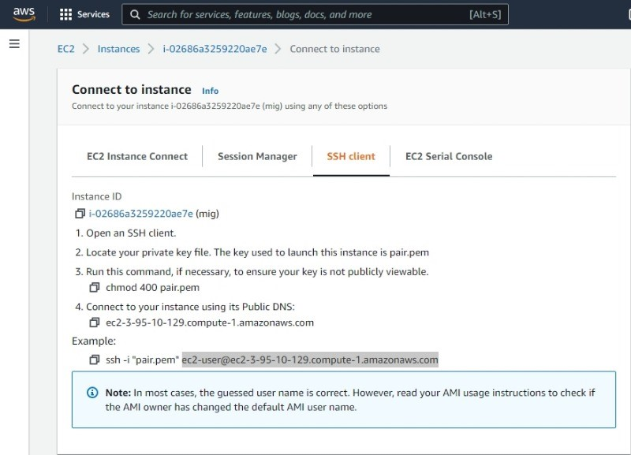
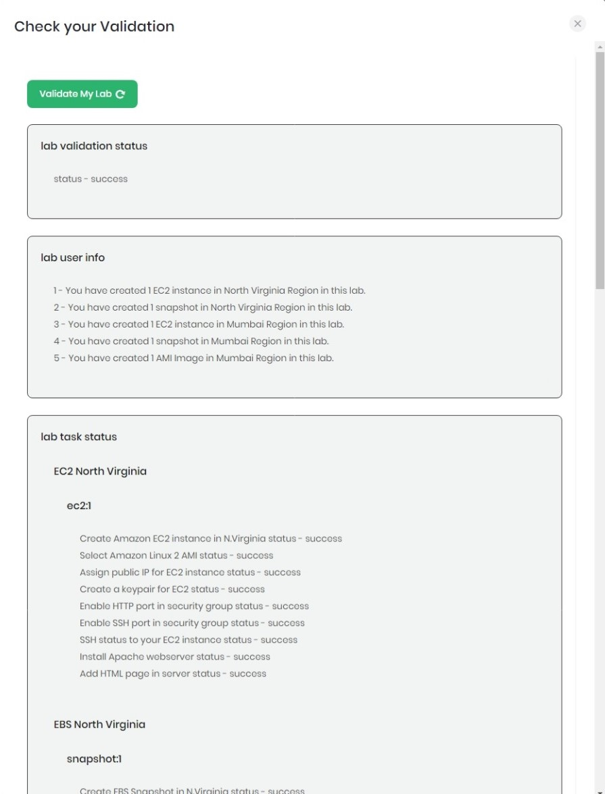

<h1 align="center">
Whizlabs Challenge League
</h1>

<h2 align="center">
Challenge Lab Three
</h2>

<h2 align="center">
Inter-Region Instance Migration - EC2 Challenge
</h2>

---

WhizLabs is running a cloud challenge between May and July 2022.  The challenge is to complete various tasks in either AWS, GCP, or Azure to test cloud skills.  Following is my solution to challenge lab three.

---
<h3>From Whizlabs</h3>

[Cloud Challenge Details](inst.jpeg)

>Your company has started using AWS for one of their clients, and the primary condition is having a copy of the complete project setup available in an emergency.  For this requirement, you create a snapshot of the primary system and copy it to another region.
In this challenge, you will use the AWS Management Console to complete the tasks that result in provisioning infrastructure to fulfill your company's requirements.\
>Follow the instructions given below to work on the challenge.
>1.	Create an Amazon EC2 Instance in N.Virginia region.
>2.	Select Amazon Linux 2 AMI and t2.micro instance type.
>3.	SSH into the EC2 Instance and host a HTML file named test.html in the EC2 root folder with exact text shown below
>     - Whizlabs Test Page
>1.	To Perform SSH operation
>     - Windows Users use Putty Software.
>     - Linux/Mac Users use Terminal.
>2.	Migrate the N.Virginia EC2 Instance to Mumbai region using EC2 snapshot.
>3.	Launch an EC2 Instance in Mumbai region by creating a Custom AMI from the snapshot with default configurations.
>4.	Test the HTML file hosted in Mumbai EC2 Instance.

---

<h3>1. Create an Amazon EC2 instance.</h3>

Login into AWS and search/choose *EC2*.

  

In EC2, click *Launch instance/launch instance*.

  

  

  

  

  

Code block

  

  

  

  

  

  

  

  

  

  

  

  

  

